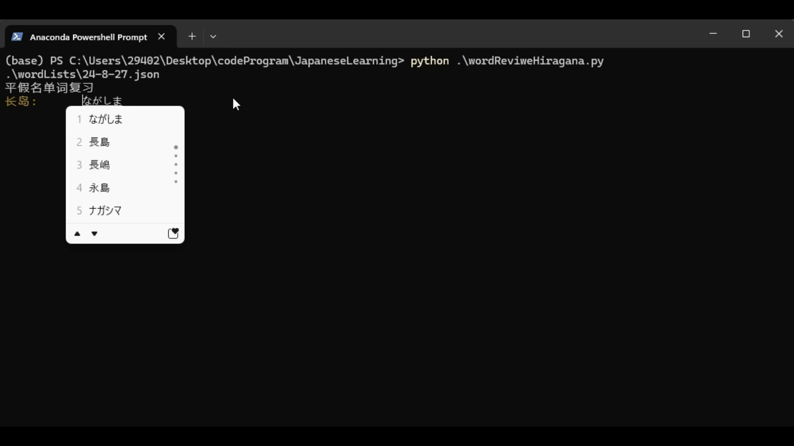

## 日语单词复习器

对于一些业余学习日语的同好们，如何对日语单词做到复习巩固，想必总是会感到一些困扰，这个程序就是为了来满足个性化的复习需求，实现单词抽查巩固的效果。

#### 结构

文件夹结构：

<pre>

|- wordLists
| |- {data}.json
|
|- wordReviewHiragana.py
|- wordReviewKatakana.py
|- readme

</pre>

- wordLists
  词表集合
- {data}.json
  以日期命名的每日词汇表
- wordReviewHiragana.py
  平假名复习入口
- wordReviewKatakana.py
  片假名复习入口

#### 功能

在终端实现单词抽查，演示图如下：

<!--  -->

同时有，错误的权重设置，此略。

#### 需要的库

- openai

#### 待实现的功能

- [ ] 接入 deepseek api，实现更轻松的词汇表创建
- [ ] 合并平假名和片假名文件为一个入口
- [ ] 创建 UI 界面以交互
- [ ] 导入词库，使用词库单词进行词汇表创建
